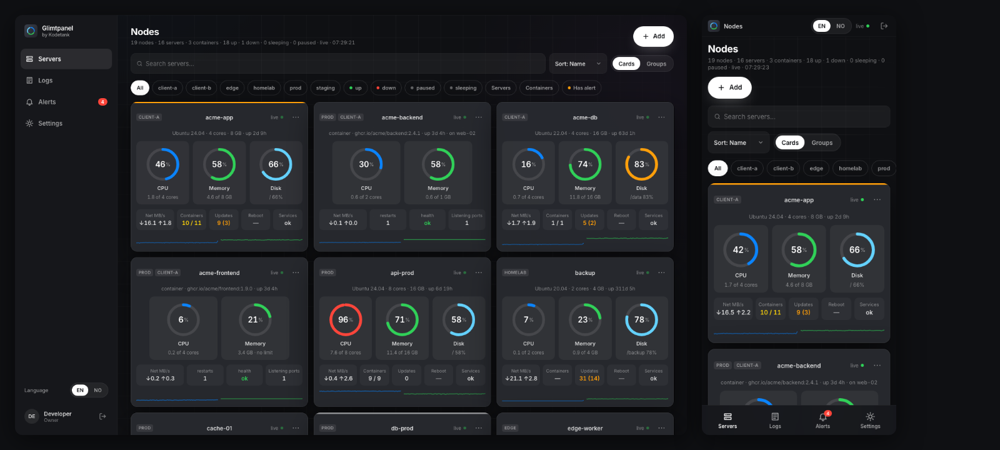

# Glimtpanel

Ett nettleservindu som viser hva alle Ubuntu-serverne dine gjør akkurat nå. En liten agent på hver server (og i hver
container du vil følge), ett dashboard for alle: CPU, minne, disk, nettverk, prosesser, containere, tjenester,
oppdateringer, sikkerhet og logger, live hvert sekund, med varsler på telefonen når noe går galt. Agenten kan bare lese.



## Legg til en server

Registrer deg, trykk «Add» i oversikten og lim inn kommandoen du får på serveren (Ubuntu 20.04–26.04, amd64/arm64):

```sh
curl -fsSL https://get.glimtpanel.com | sh -s -- --key gp_…
```

Skriptet laster ned binæren fra GitHub-utgivelsen, verifiserer SHA-256, legger den i `/usr/local/bin/glimt-agent`,
skriver en herdet systemd-enhet (`systemd-analyze security` under 3, egen systembruker, `ProtectSystem=strict`,
syscall-filter) og starter den. Serveren står i dashbordet innen 30 sekunder. Containere leses gjennom
[docker-socket-proxy](https://github.com/Tecnativa/docker-socket-proxy) med `POST=0` (standard) eller docker-gruppen
(`--docker simple`, root-ekvivalent, advares om). Fjern alt med `sudo glimt-agent uninstall`.

### Overvåke en container

«Add container» i dashbordet gir et token (`agt_…`). Agenten kan ligge i appens eget image eller kjøre som sidecar.

**Binær i eget image** (anbefalt; virker også på Cloud Run, Fargate, Railway, Render). Agenten deler cgroup med appen
og får ekte CPU- og minnetall. Krever `/bin/sh` i imaget:

```Dockerfile
COPY --from=ghcr.io/opdahlmann/glimt-agent:latest /glimt-agent /usr/local/bin/glimt-agent
ENV GLIMT_HUB=wss://api.glimtpanel.com/agent/ws GLIMT_NODE_NAME=api-1
ENTRYPOINT ["/bin/sh", "-c", "glimt-agent run & exec \"$0\" \"$@\""]
CMD ["node", "server.js"]        # appens egen startkommando, f.eks. ["dotnet", "Api.dll"] eller ["nginx", "-g", "daemon off;"]
```

`CMD` er kommandoen imaget startet med fra før; `ENTRYPOINT` starter agenten i bakgrunnen og kjører deretter `CMD`
som PID 1 via `exec`, så appen oppfører seg som før og agenten dør med containeren. Har imaget allerede en
`ENTRYPOINT`, sett den inn som `CMD` i stedet. `GLIMT_TOKEN` settes som hemmelighet ved kjøring, ikke i imaget.
Noden vises med navnet du ga i «Add container»; `GLIMT_NODE_NAME` blir vertsnavnet. Stoppes containeren, får ikke agenten
noe signal (appen er PID 1), så noden vises som *down* etter kort tid i stedet for *sleeping*.

**Sidecar i Compose.** Appimaget røres ikke. Med Dockers standard ser sidecaren bare sin egen cgroup og summerer
prosesser (`approx`); legg `cgroup: host` på sidecaren for ekte tall.

```yaml
services:
  app:
    image: your-app:latest
  glimt-agent:
    image: ghcr.io/opdahlmann/glimt-agent:latest
    pid: "service:app"
    network_mode: "service:app"
    read_only: true
    environment:
      GLIMT_HUB: wss://api.glimtpanel.com/agent/ws
      GLIMT_TOKEN: agt_…
      GLIMT_NODE_NAME: api-1
```

Stdout-logger krever en vertsagent på maskinen; ellers pekes `GLIMT_LOG_PATHS` på appens loggfiler. Valgfrie variabler
(`GLIMT_HEALTH_URL`, `GLIMT_CHECKS`, `GLIMT_LOG_PATHS`) og hva agenten ser inne i en container: `apps/glimt-agent/README.md`
(«Containernoder»). Noder kan samles i personlige **grupper** (⋯ på et kort → «Add to group…»); gruppevisningen viser
hver gruppe som ett kort med summene til medlemmene. `/demo` viser hele dashbordet uten innlogging, med falske servere.

## Målte tall

| Hva | Tall | Kilde |
|---|---|---|
| Agent i hvile, tilkoblet, `snapshot` hvert 30. s | 15 MB RSS, 0,08 % av én kjerne | `apps/glimt-agent/README.md` («Målt ressursbruk») |
| Agent, oppstart (første snapshot, vedlikehold, journal-tellere) | ≈ 1 s CPU | samme |
| Sidecar-image (`ghcr.io/opdahlmann/glimt-agent`) | under 15 MB, `FROM scratch` | CI-sjekk `build-images` |
| Hub med 100 agenter og 10 nettlesere på oversikten (`scripts/loadtest/run.mjs`) | 340 MB RSS på topp, 6,6 % av én kjerne i snitt (topp 23 %), 100/100 agenter tilkoblet, 0 droppede `stream`, 3 min | målt 2026-09-15 på Apple Silicon, `dotnet run` |
| Lagring av 100 fulle 24-timersbuffere (288 000 punkter) | under 1 s | `BufferTests.A_hundred_full_buffers_are_saved_in_under_a_second` |
| Web, første last | 94 kB gzip initial bundle | `apps/glimt-web/README.md` (fase 9) |

## Regler som aldri brytes

1. Agenten har ingen skrivekommandoer i protokollen. Den kan ikke endre noe på serveren.
2. Måledata går agent → hub → nettleser i minnet. Databasen ser aldri et måledatapunkt.
3. Logger videresendes bare mens en loggvisning er åpen, og lagres aldri.
4. 1 s-strømmen går bare når noen ser på; 30 s-øyeblikksbildet driver buffer og varsler.

## Privacy

*Written for people who create an account. The full policy moves to glimtpanel.com when the website is built.*

- **What the agent sends:** CPU, memory, disk, network, process names and command lines of the top processes,
  container names and images, systemd unit states, pending updates, listening ports, logged-in users, failed SSH
  attempts and firewall counters. Nothing else, and it cannot change anything on the server (the protocol has no
  write commands; the source is open).
- **What is stored:** your account (e-mail, name, password hash), server names, tags, alert settings, access grants
  and groups in MongoDB. Measurements live only in the hub's memory: a 24-hour ring per server that is written to a
  local file every 15 minutes so it survives a restart. Nothing older than 24 hours exists anywhere.
- **Logs are never stored.** Log lines stream from the agent to your browser only while you have a log view open, and
  the hub keeps none of them.
- **Who sees what:** only you, and people you have explicitly given read access to. The demo account is read-only.
- **E-mail:** confirmation, password reset, invitations and the alerts you have turned on. No newsletters, no tracking
  pixels. Push notifications go through your browser's push service with an encrypted payload.
- **Delete:** «Settings › Data › Delete everything» removes the account, its servers, grants, groups and alert history
  at once; «Download everything» gives you the same data as JSON first. Agents you leave behind are told to stop.
- **Hosting:** Dokploy on a server in the EU; MongoDB on the same server; no third-party analytics.

Questions: post@kodetank.no.

## Prosjekter

| Del | Sti | Hva |
|---|---|---|
| glimt-agent | `apps/glimt-agent` | Go-binær på serveren. Leser CPU, minne, disk, nettverk, prosesser, containere og logger og sender dem til huben. |
| glimt-hub | `apps/glimt-hub` | .NET 10-tjeneste: innlogging, servere, tilganger, 24-timersminne, varsler og sanntidsstrømmen til dashbordet. |
| glimt-web | `apps/glimt-web` | Angular-dashbord (PWA): alle servere, detaljer per server, logger og varsler. |
| glimt-site | `apps/glimt-site` | Nettsiden i Astro. Kun et skall foreløpig. |
| protocol | `packages/protocol` | JSON Schema for agent ↔ hub, med eksempler begge sider testes mot. |
| design-tokens | `packages/design-tokens` | Delte designtokens og Inter-fonter. |
| e2e | `e2e` | Playwright i tre prosjekter: `desktop-chromium`, `mobile-webkit`, `mobile-chromium`. |

Hver mappe har en README som beskriver hva som er bygget og hvordan det testes.

## Komme i gang (utvikling)

Krav: Node 22+, .NET SDK 10, Docker Desktop. Go trengs ikke, agenten bygges og testes i Docker.

```sh
git config core.hooksPath .githooks   # nekter commit av markdown (utenom README.md og CLAUDE.md) og .env-filer
npm install
cp example.env .env                   # Docker-containere lokalt
cp example.env .env.dev               # hub og web direkte på maskinen; sett GLIMT_MONGO_URI
npm run doctor                        # sjekker verktøyene
npm run dev                           # hub (dotnet watch) + Ubuntu-container med agenten + web (ng serve)
```

Dashbordet svarer på http://localhost:4200 og huben på http://localhost:5080. Agent-containeren `glimt-agent-dev`
kobler seg til huben med `GLIMT_DEV_ENROL_KEY`. Logg inn med `GLIMT_DEV_USER_EMAIL` og `GLIMT_DEV_USER_PASSWORD` fra `.env`;
huben oppretter kontoen ved oppstart når `GLIMT_ENV=development`. Flagg til `npm run dev`: `--no-agent`, `--no-web`, `--no-hub`, `--site`,
`--plain-agent` og `--sidecar` (starter i tillegg nginx-containeren `glimt-app-dev` med agenten som sidecar, synlig som
containernoden `sidecar-dev` på dev-kontoen via `GLIMT_DEV_CONTAINER_TOKEN`).

| Kommando | Gjør |
|---|---|
| `npm run dev:hub` / `dev:web` / `dev:agent` / `dev:site` | Starter én del |
| `npm run dev:stop` | Stopper agent-containeren og løpende prosesser |
| `npm test` | Unit-tester for web (Vitest), hub (xUnit) og agent (`go test` i Docker) |
| `npm run test:e2e` | Playwright (`GLIMT_E2E_BUILT=1` for bygget hub og web som i CI) |
| `npm run lint` | ESLint og `dotnet format` |
| `npm run build` | Bygger web, hub (Release) og site |
| `npm run build:images` | Bygger Docker-imagene slik Dokploy gjør det |
| `npm run dev:agent -- --logs` / `--shell` / `--measure` | Journal, shell eller ressursmåling i agent-containeren |
| `node scripts/agent-container.mjs --sidecar` / `--sidecar-check` / `--sidecar-logs` / `--sidecar-snapshot` / `--sidecar-stop` | Sidecar-containeren mot den lokale huben |
| `node scripts/live-tail.mjs --dev-token dev@glimtpanel.local` | Følger SignalR-strømmen i terminalen uten web |
| `node scripts/loadtest/run.mjs` | Lasttest: 100 falske agenter + 10 nettlesere, måler huben |

CI (`.github/workflows/ci.yml`): lint, kontrakt, unit-tester, `npm audit`/`dotnet list package --vulnerable`/
`govulncheck`, Docker-imagene, hele e2e-suiten mot bygget hub og web (uten skjermbildesammenligning, snapshotene er fra macOS), og agentutgivelse (binærer, `SHA256SUMS` og
sidecar-image til ghcr.io) ved tag `agent/v*`. `nightly.yml` kjører skjerm 4, 5 og 7 mot den ekte agenten i
Ubuntu-containeren.

## Utrulling (Dokploy)

Tre applikasjoner i ett Dokploy-prosjekt, alle med Build Type **Dockerfile**, Build Context `.` (repo-roten) og tomt
felt for Build-time Arguments. Ingenting bakes inn i imagene: alt leses fra fanen **Environment** når containeren
starter, så «Redeploy» holder etter en endring. Nøklene er de i `example.env`; `.env.prod` er det som limes inn.

| App | Dockerfile Path | Port | Domene | Environment |
|---|---|---|---|---|
| glimt-hub | `apps/glimt-hub/Dockerfile` | 8080 | `api.<domene>` | «Hub», «E-post» og «Web Push» fra `example.env`, `GLIMT_ENV=production`, `GLIMT_DEMO_MODE=true`. Volum på `/data` for 24-timersbufferen. |
| glimt-web | `apps/glimt-web/Dockerfile` | 80 | `app.<domene>` | `GLIMT_HUB_INTERNAL_URL=http://<hubens tjenestenavn>:8080` og det web viser: `GLIMT_ENV`, `GLIMT_HUB_PUBLIC_URL`, `GLIMT_INSTALL_URL`, `GLIMT_VAPID_PUBLIC`, `GLIMT_DEFAULT_LANG`, `GLIMT_FEATURE_FLAGS`. |
| glimt-site | `apps/glimt-site/Dockerfile` | 80 | apex og `www` | ingen |

- **Hubens tjenestenavn** står i hubens Logs-fane som `<tjenestenavn>.1.<id>`. Alle apper ligger på `dokploy-network`;
  nginx slår navnet opp per forespørsel, så web starter selv om huben er nede og følger med når den får ny IP.
- **TLS termineres i Traefik.** Containerne snakker ren HTTP. nginx sender Traefiks `X-Forwarded-Proto` videre, og huben
  leser `X-Forwarded-*` (Secure på oppfriskningskaken, hastighetsbegrensning per klient, riktig IP i loggen).
- **DNS først.** Alle domener må peke på verten før første deploy, ellers feiler Let's Encrypt. `get.glimtpanel.com`
  peker på hubens `/install`.
- **Helsesjekk:** `/readyz` gir 200 med database og 503 uten, og passer som helsesjekk for automatisk tilbakerulling.
  `/healthz` svarer alltid og viser versjon, database og tilkoblede agenter.
- **Røyktest etter deploy:** `/readyz` → 200, innlogging i appen (beviser `/api`-proxyen), en agent som kobler til
  (beviser WebSocket gjennom Traefik), `docker service ls` → alle `1/1`.
- Baseimagene hentes fra MCR og ECR Public, ikke Docker Hub, så byggene ikke stopper på Docker Hubs pull-grense.
  Dokploy lagrer Environment i klartekst; roter `GLIMT_JWT_SECRET` og API-nøkler som har ligget der ved behov.

## Miljøfiler og git

- Alle nøkler har prefiks `GLIMT_` og er dokumentert i `example.env`, den eneste env-filen som sjekkes inn. `.env` gjelder
  Docker-containere lokalt, `.env.dev` overstyrer når hub og web kjører direkte på maskinen, `.env.prod` limes inn i Dokploy.
- Av markdown-filer sjekkes kun `README.md` og `CLAUDE.md` (instruksjoner til Claude Code) inn. `.githooks/pre-commit`
  håndhever begge reglene.

## Lisens

Ingen lisens er valgt ennå. Til en LICENSE-fil er lagt inn, er all rett forbeholdt.
